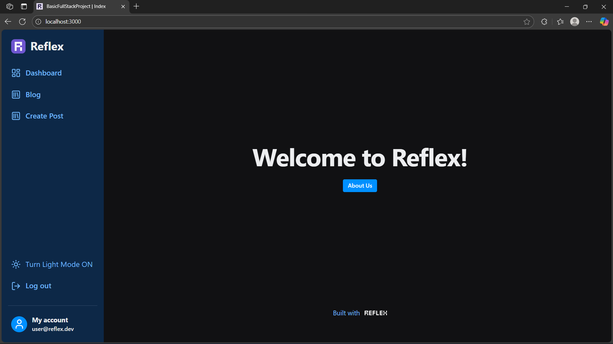
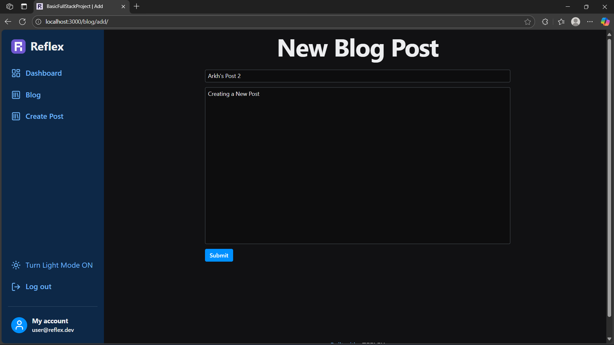
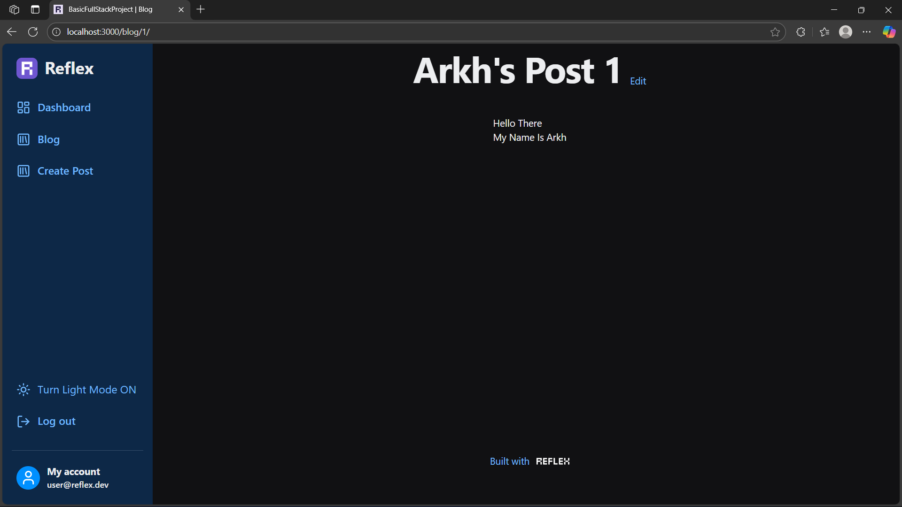
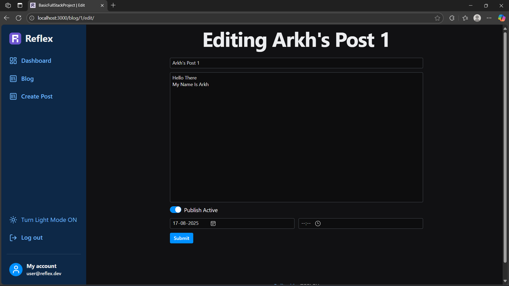
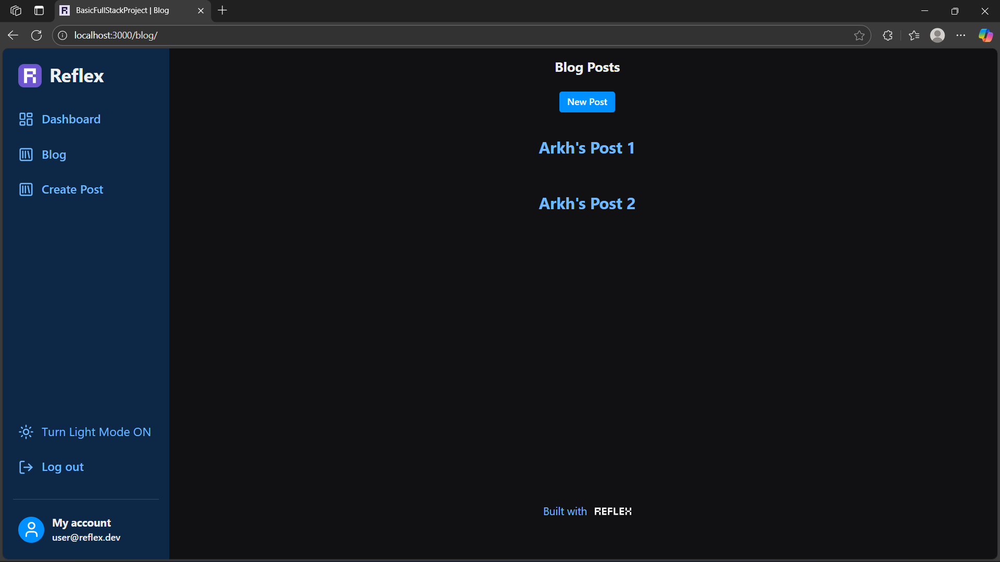

# Reflex Blog: A Full-Stack Blog Application

[](https://www.python.org/downloads/)

[](https://reflex.dev/)

A modern, full-stack blog application built entirely in Python with the [**_Reflex_**](https://reflex.dev/) framework. This project demonstrates how to build a clean, dynamic, and fully functional blog platform—from frontend rendering to backend state management—with zero JavaScript required.

This repository serves as both a learning resource and a starter template for anyone looking to build content-driven web applications with pure Python.

## ✨ Features

*   **Pure Python Stack**: Frontend and backend built with a single language.
*   **Reactive UI**: The user interface automatically updates in response to state changes.
*   **Full CRUD Functionality**: Create, read, update, and delete blog posts.
*   **Dynamic Routing**: Each blog post gets its own unique, shareable URL.
*   **Markdown Support**: Write and render blog posts using Markdown.
*   **User Scaffolding**: Includes a sidebar with user account and logout links.
*   **Theming**: Simple toggle for Light/Dark mode.
*   **Extensible Design**: Easy to add features like theming, comments, and more.

## 📸 Screenshots

- **Blog Home**


- **Create New Post**


- **View Post**


- **Edit Post**


- **List of Blogs**


## 🛠️ Technology Stack

*   **Framework**: [Reflex](https://reflex.dev/)
*   **Language**: Python
*   **Database**: Easily configurable (defaults to a simple file or SQLite)
*   **UI Components**: Built-in Reflex component library

## 🚀 Getting Started

Follow these instructions to get a local copy of the project up and running.

### Prerequisites

*   Python 3.9+ and `pip`
*   [Git](https://git-scm.com/)

### Installation

1.  **Clone the repository:**
    ```bash
    git clone https://github.com/Arkya-Bhatt/Basic_Full_Stack_Project.git
    
    cd Basic_Full_Stack_Project
    ```

2.  **Create and activate a virtual environment:**
    ```bash
    # For macOS/Linux
    python3 -m venv .venv
    source .venv/bin/activate

    # For Windows
    python -m venv .venv
    .venv\Scripts\activate
    ```

3.  **Install the required dependencies:**
    ```bash
    pip install -r requirements.txt
    ```

4.  **Initialize the Reflex app:**
    ```bash
    reflex init
    ```

5.  **Run the application:**
    ```bash
    reflex run
    ```

The application will now be running at `http://localhost:3000`.

## 📂 Project Structure

```
Basic_Full_Stack_Project/
├── requirements.txt    # Python dependencies
├── rxconfig.py   # Reflex project configuration
└── Basic_Full_Stack_Project/
      ├── auth/
      │ ├── forms.py    # Login/registration forms
      │ ├── models.py   # User database model
      │ ├── pages.py    # Login/registration pages
      │ └── state.py    # Authentication state
      ├── blog/
      │ ├── add.py      # Page to create a new post
      │ ├── detail.py   # Page to view a single post
      │ ├── edit.py     # Page to edit an existing post
      │ ├── forms.py    # Form for creating/editing posts
      │ ├── list.py     # Page listing all blog posts
      │ ├── model.py    # Post database model
      │ └── state.py    # Blog-related state
      ├── contact/
      │ ├── form.py     # Contact form component
      │ ├── model.py    # Model for contact submissions
      │ ├── page.py     # The "Contact Us" page
      │ └── state.py    # State for the contact form
      ├── navigation/
      │ ├── routes.py   # Defines all URL routes for the app
      │ └── state.py    # Global navigation state
      ├── pages/
      │ ├── about.py    # The "About Us" page
      │ ├── pricing.py  # The "Pricing" page
      │ └── protected.py      # Example of a page requiring login
      ├── ui/
      │ ├── base.py     # Base page template with header/footer/sidebar
      │ ├── dashboard.py      # Main dashboard component
      │ ├── nav.py      # Top navigation bar component
      │ └── sidebar.py  # Sidebar navigation component
      ├── utils/
      │ └── timing.py   # Utility functions (e.g., for dates)
      │
      └── Basic_Full_Stack_Project.py     # Main app entry point
```

*   **`auth/`**: Handles user authentication, including registration, login pages, forms, and state.
*   **`blog/`**: Contains all logic for the blog functionality. This includes pages for listing, viewing, creating, and editing posts, as well as the data model and state management for posts.
*   **`contact/`**: Implements the "Contact Us" page, form, and backend logic to handle submissions.
*   **`navigation/`**: Defines the application's URL routes (`routes.py`) and manages global navigation state.
*   **`pages/`**: Holds miscellaneous static or simple pages like 'About Us', 'Pricing', and protected routes.
*   **`ui/`**: Contains reusable user interface components, such as the main layout (`base.py`), sidebar, and navigation bar.
*   **`utils/`**: A utility module for common helper functions.
*   **`Basic_Full_Stack_Project.py`**: The main entry point of the application. It initializes the Reflex app and ties all the modules together.

## 📈 Future Enhancements

This project is a great starting point. Here are some ideas for extending its functionality:

*    Integrate a production-grade database like **PostgreSQL** or **MySQL**.
*    Implement a **user comment** system for posts.
*    Add **categories and tags** to organize posts.
*    Enhance the post editor with a more advanced **Markdown/Rich-Text editor**.
*    Add **user authentication** to restrict post creation and editing.

## 🤝 Contributing

Contributions are welcome! If you have a feature to add or a bug to fix, please follow these steps:

1.  Fork the repository.
2.  Create a new branch (`git checkout -b feature/YourAmazingFeature`).
3.  Commit your changes (`git commit -m 'Add some amazing feature'`).
4.  Push to the branch (`git push origin feature/YourAmazingFeature`).
5.  Open a Pull Request.